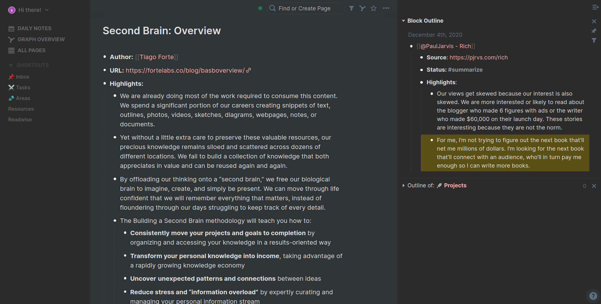

# roam-outer-space-theme

Theme I use for all my note taking apps ported to Roam (mostly colors tbh). Highly unpolished. Feel free to contribute.

This theme is heavily based on the excellent (and highly polished) [better-roam-research](https://github.com/linuz90/better-roam-research) theme.

## Screenshot



## How to use

1. Create a page named `roam/css` (it must be named this way).
2. Create a css block with ```.
3. Copy and paste the contents of `roam-outer-space.css` file or add an `@import` rule.

🖖

## Changelog

### [2020-12-10]

- `<em>` element is now used to do highglights. This is done to be able to have bold and highlighted passages and it enables Progressive Summarization. It's impossible to use regular Roam highlights on a bolded text (so far 🤞). See instructions below to disable this rule.
- Unified the look of the top bar, now it's the same color as the main section.
- Fixed some minor spacing issues.
- Disabled usless animations of the sidebar and main section.

To disable <em> highlighting, remove the following rule:

```
em {
  text-decoration: none !important;
  font-style: normal !important;
  background-color: #ffee003d;
}
```
